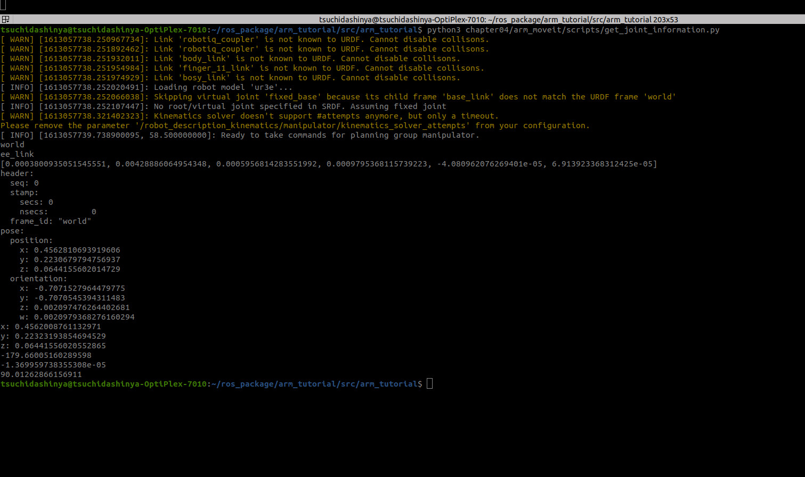

# chapter04
## arm_moveit
```
roslaunch arm_moveit ur3e_setup.launch
```
<div style="text-align: center;">

</div>
```
rosrun arm_moveit get_joint_information.py
```
<div style="text-align: center;">

</div>